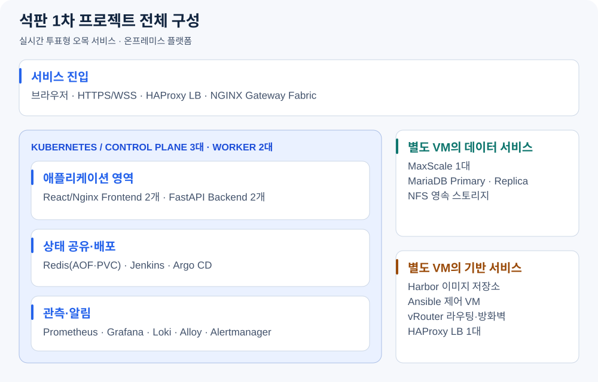

# 石나가는 판단 · SeokPan

**온프레미스 Kubernetes 플랫폼을 구축하고, AWS 하이브리드 환경으로 이전하며 인프라 자동화·배포·장애·복구·성능·비용을 검증하는 4인 팀 프로젝트입니다.** 실시간 투표형 오목 서비스를 공통 검증 워크로드로 사용합니다. 1차와 2차의 설계·구현·검증 결과는 각각 독립적으로 관리합니다.

| 프로젝트 | 중심 과제 | 상태와 대표 자료 |
|---|---|---|
| [1차 · 온프레미스 Kubernetes 플랫폼 구축](#phase-1) | 서버·네트워크·클러스터 자동화, 서비스 통합, 배포·관측·복구 | 종료 기준 구현·통합 완료 · [1차 결과와 검증 범위](https://github.com/seokpan/seokpan-docs/blob/main/CURRENT_STATE.md) |
| [2차 · AWS 하이브리드 마이그레이션](#phase-2) | 서비스·데이터·운영 책임 재배치, IaC 재현성, 장애·복구·성능·비용 검증 | 구현·검증 진행 · [2차 설계와 결과 기록](https://github.com/seokpan/seokpan-hybrid-docs) |

## 저장소 바로가기

| 역할 | 1차 · 온프레미스 | 2차 · AWS 하이브리드 |
|---|---|---|
| 설계·결과·검증 근거 | [seokpan-docs](https://github.com/seokpan/seokpan-docs) | [seokpan-hybrid-docs](https://github.com/seokpan/seokpan-hybrid-docs) |
| 인프라 코드·자동화 | [seokpan-infra](https://github.com/seokpan/seokpan-infra) | [seokpan-hybrid-infra](https://github.com/seokpan/seokpan-hybrid-infra) |
| 배포 선언·운영 구성 | [seokpan-gitops](https://github.com/seokpan/seokpan-gitops) | [seokpan-hybrid-gitops](https://github.com/seokpan/seokpan-hybrid-gitops) |
| 검증 서비스·테스트 | [seokpan-app](https://github.com/seokpan/seokpan-app) | [seokpan-hybrid-app](https://github.com/seokpan/seokpan-hybrid-app) |

## 2차 프로젝트 · AWS 하이브리드 마이그레이션

1차의 서비스와 운영 자산을 바탕으로 AWS와 온프레미스의 역할을 재배치하는 프로젝트입니다. 목표 운영모델은 **Cloud Primary + On-Prem Restore-based Recovery**입니다. 정상 사용자 요청을 AWS에서 처리하고, 온프레미스는 CI·복구 이미지·백업 사본과 복구 검증을 담당하도록 설계했습니다.

### 아키텍처

현재 그림은 승인된 설계 목표입니다. 설계판은 보존하고, 실제 배치·시험 근거가 확보되면 구축 결과판을 별도로 추가합니다. 최종 소개에는 구축 결과판과 설계 차이를 연결합니다.

- **AWS 서비스 경로**: ROSA Classic Multi-AZ에 Frontend·Backend를 배치하고, RDS for MariaDB Multi-AZ와 ElastiCache for Redis OSS Multi-AZ로 데이터·Runtime State를 관리하는 구성입니다.
- **온프레미스 복구 경로**: Jenkins는 사전 Build·검증을, Harbor는 복구 이미지 보존을 맡도록 설계했습니다. Offline Recovery에서는 사전 확보한 백업·설정·이미지로 별도 MariaDB·Recovery Redis와 애플리케이션을 복원하며, Jenkins Controller의 복구를 서비스 복원 필수조건으로 두지 않습니다.
- **하이브리드 연결 경계**: 관리·백업·복구 통신을 연결하며, AWS 정상 사용자 요청의 필수 경로에 온프레미스와 하이브리드 연결을 포함하지 않습니다.

구조와 선택 근거는 [목표 아키텍처](https://github.com/seokpan/seokpan-hybrid-docs/blob/main/design/02_TARGET_ARCHITECTURE.md), 배치·보안·데이터·시험 조건은 [상세설계](https://github.com/seokpan/seokpan-hybrid-docs/blob/main/design/03_DETAILED_DESIGN.md)에 정리했습니다.

### 핵심 설계와 구현 범위

아래는 2차가 구현·검증할 범위입니다. 실제 코드와 수행 결과는 각 저장소 및 검증 기록에 연결합니다.

| 영역 | 설계·구현 범위 | 코드·설계 근거 |
|---|---|---|
| 인프라 재현성 | Terraform의 `bootstrap`·`foundation`·`rosa` Root/State 분리, 유지할 데이터 기반과 반복 생성·삭제할 클러스터의 수명주기 관리 | [Infra](https://github.com/seokpan/seokpan-hybrid-infra) |
| 플랫폼 배포 | Terraform과 GitOps의 Resource Ownership 분리, ROSA OpenShift GitOps 및 환경별 선언, Secret 별도 공급; Recovery 선언은 사전 Render·보존 | [GitOps](https://github.com/seokpan/seokpan-hybrid-gitops) |
| 서비스 이관 | 검증된 1차 Source를 Seed로 고정하고 변경 이력을 보존, ROSA 실행·권한·TLS·DB/Redis 연결과 대표 업무 흐름 적용 | [App](https://github.com/seokpan/seokpan-hybrid-app) |
| 이미지와 배포 | Jenkins의 Build·Test·Scan, ECR/Harbor 이미지 대응, Digest와 승인된 배포 선언의 연결 | [CI·배포 설계](https://github.com/seokpan/seokpan-hybrid-docs/blob/main/design/03_DETAILED_DESIGN.md) |
| 백업과 복구 | Portable Backup 사전 동기화, 격리 Restore와 별도 Recovery Runtime; 보존한 Manifest를 Infra Ansible로 적용하고 외부 신규 조회에 의존하지 않는 Offline Recovery 시험 | [실행·복구 기록](https://github.com/seokpan/seokpan-hybrid-docs/blob/main/execution/05_IMPLEMENTATION_AND_VALIDATION.md) |
| 관측성과 비용 | 사용자 영향·Metric·Log·Timeline의 연결, ROSA 가동 구간과 자원 생성·보존·삭제에 따른 비용 관리 | [Evidence](https://github.com/seokpan/seokpan-hybrid-docs/tree/main/evidence) |

### 검증 결과

승인된 목표와 실측 결과를 함께 기록합니다. 아직 확보하지 않은 결과는 입력 예정으로 표시하며, 최종값은 시험 조건·판정·원본 Run과 함께 채웁니다.

| 검증 관점 | 승인 기준·확인할 내용 | 실측 결과·판정 | 원본 근거 |
|---|---|---|---|
| 대표 업무·성능 | Target 60명·Warm-up 후 30분, HTTP/WS 업무 p95 ≤1초, 예기치 않은 오류율 <1%, 중복·권한 없는 성공·확정 데이터 불일치 0건 | 결과 입력 예정 | Run 링크 입력 예정 |
| 재접속·상태 수렴 | 정상 의존 서비스 가용 후 30초 이내 수렴 | 결과 입력 예정 | Run 링크 입력 예정 |
| 장애와 사용자 영향 | Worker·RDS·Redis 장애의 사용자 오류·업무 정상화·데이터 정합성 | 영향·시간선·판정 입력 예정 | Run 링크 입력 예정 |
| 하이브리드 연결 장애 | 연결 중단 시 Cloud 정상 업무와 백업·복구 경로의 영향 구분 | 결과 입력 예정 | Run 링크 입력 예정 |
| 관측성 | 장애와 Metric·Log·Event·Alert, 운영 판단과 정상화의 연결 | 탐지·판단·확인 범위 입력 예정 | Run 링크 입력 예정 |
| 보안 경계 | IAM·Secret·TLS·공개 노출·Image의 실제 허용·거부와 적용 범위 | 확인 범위·판정 입력 예정 | 검증 기록 링크 입력 예정 |
| Offline Recovery | RTO ≤30분, RPO ≤90분; 대표 업무·데이터 확인까지 측정 | RTO·RPO·손실·판정 입력 예정 | Run 링크 입력 예정 |
| Clean Recreate | 인프라 재생성부터 Secret·GitOps·App·E2E까지 재현 | 범위·수동 단계·소요시간·판정 입력 예정 | Run 링크 입력 예정 |
| AWS 비용 | 프로젝트 총 사용비용 $500 이내 | 실제 비용·가동 조건 입력 예정 | 비용 기록 링크 입력 예정 |

<!-- 최종화: 승인 목표는 임의로 바꾸지 않는다. 실제 결과가 PARTIAL/FAIL/NOT RUN/N/A이면 해당 판정과 이유를 유지한다. 결과 입력 이후 이 절의 '입력 예정' 안내를 제거하고 검증된 대표 결과만 남긴다. -->

공식 시험 조건은 [상세설계](https://github.com/seokpan/seokpan-hybrid-docs/blob/main/design/03_DETAILED_DESIGN.md), 실제 수치와 시간선은 [Evidence Index](https://github.com/seokpan/seokpan-hybrid-docs/blob/main/evidence/README.md)에서 확인합니다.

### 문제해결과 최종 자료

| 자료 | 최종적으로 연결할 내용 |
|---|---|
| 대표 문제해결 | 실제 문제 → 원인 → 조치 → 동일 조건 재검증 → 남은 한계를 보여주는 사례와 근거 링크 입력 예정 |
| 데모·발표 | AWS 대표 업무와 의미 있는 배포·장애·복구 과정을 보여주는 영상·발표자료 링크 입력 예정 |
| 목표 달성과 한계 | 성공·부분 성공·미실행 범위, 운영 책임과 비용의 Trade-off를 정리한 최종 결과 링크 입력 예정 |

<!-- 최종화: 사건·영상·발표자료가 확보된 뒤 실재하는 제목과 링크로 교체한다. 발표 선별 기준은 presentation/PRESENTATION_BASELINE.md를 따르고 원본 Evidence를 이 README에 복제하지 않는다. -->

### 2차 저장소

| 저장소 | 책임 |
|---|---|
| [seokpan-hybrid-docs](https://github.com/seokpan/seokpan-hybrid-docs) | 설계·의사결정, Migration 기록, Runbook, 검증·비용·문제해결과 최종 자료 |
| [seokpan-hybrid-infra](https://github.com/seokpan/seokpan-hybrid-infra) | Terraform 기반 AWS·ROSA 구성, Bootstrap, 하이브리드 연결·백업·복구 자동화 |
| [seokpan-hybrid-gitops](https://github.com/seokpan/seokpan-hybrid-gitops) | ROSA 및 별도 온프레미스 Recovery 환경의 애플리케이션·플랫폼 배포 선언 |
| [seokpan-hybrid-app](https://github.com/seokpan/seokpan-hybrid-app) | 서비스 이관과 환경 적용, Frontend·Backend 코드, 테스트·이미지 빌드 |

## 1차 프로젝트 · 온프레미스 Kubernetes 플랫폼 구축

검증 서비스는 참여자가 흑·백 팀에 속해 착수 좌표에 투표하고, 서버가 투표를 마감해 한 수를 확정하는 실시간 오목 게임입니다. 로그인·로비·대기방·게임·채팅·결과 흐름을 통해 인증, 상태 저장, 실시간 통신과 플랫폼 연동을 확인합니다.

VMware·CentOS Stream 9 기반 **물리 호스트 4대, VM 16대**에 Kubernetes Control Plane 3대와 Worker 2대를 구성하고, 네트워크·데이터베이스·스토리지·배포·관측성을 서비스와 통합했습니다. 공식 종료 Baseline은 **2026-09-23**입니다.

### 아키텍처

- **서비스 요청**: HAProxy를 거쳐 NGINX Gateway Fabric에 도달하며, 페이지 요청은 Frontend로, `/api/v1`·`/ws/v1`은 Backend로 전달됩니다. HTTPS/WSS와 인증서 공급 경로를 구성했습니다.
- **상태 저장**: MariaDB는 회원·공식 착수·결과·레이팅을, Redis는 세션·방·투표·접속 상태를 맡습니다. Backend 2개 Replica가 같은 저장소를 사용하고, DB 접속은 MaxScale과 TLS를 거칩니다.
- **구축과 배포**: Ansible이 서버·클러스터 기반을 구성하고, Jenkins가 검증된 이미지로 GitOps PR을 생성합니다. 팀원의 승인·Merge 후 Argo CD가 배포 선언을 반영합니다.

### 핵심 구현

| 영역 | 구현한 내용 | 코드·자료 |
|---|---|---|
| 인프라 자동화 | Ansible Role로 라우팅·방화벽·HAProxy, kubeadm·containerd·Calico, DB·NFS 및 인증서 공급 구성 | [Infra](https://github.com/seokpan/seokpan-infra) |
| 검증 서비스 | React·TypeScript UI와 FastAPI HTTP/WebSocket API, MariaDB·Redis 기반 투표 마감·결과 저장 및 Replica 간 상태 공유 | [App](https://github.com/seokpan/seokpan-app) |
| 승인 기반 배포 | Jenkins 테스트·이미지 빌드·스캔, Harbor Digest 확정, 변경 컴포넌트의 GitOps PR 생성과 Argo CD 동기화 | [이미지 파이프라인](https://github.com/seokpan/seokpan-app/blob/main/Jenkinsfile.image-pipeline) · [GitOps](https://github.com/seokpan/seokpan-gitops) |
| 관측성 | Prometheus, Alloy·Loki, Grafana·Alertmanager를 이용한 Metric·Log·Dashboard·알림 구성 | [Observability](https://github.com/seokpan/seokpan-gitops/tree/main/observability) |
| 데이터·복구 | MariaDB 복제·백업 체인, etcd Snapshot 복구 자동화, Redis AOF/PVC와 복구 검증 | [복구 Playbook](https://github.com/seokpan/seokpan-infra/tree/main/ansible/playbooks) |

### 검증 결과와 완료 범위

| 검증 영역 | 기록된 결과 |
|---|---|
| 서비스 통합 | Gateway HTTPS/API/WebSocket, Backend·Frontend 각 2개 Replica, 브라우저 게임 정상 흐름과 랭킹·통계 확인 |
| 배포 운영 | 실제 GitOps Promotion PR 생성, Argo CD Self-Heal, Git Revert 기반 Runtime Rollback 확인 |
| 관측성 | Backend 2개 Replica의 Prometheus Target `UP`, 앱 Metric과 구조화된 오류 Log의 Loki 조회 확인 |
| MariaDB 복구 | 양쪽 DB 유실 시나리오에서 단일 노드 서비스 재개 **1분 29초**, 이중화 정상화 **4분**, 미백업 데이터 **3건 손실** |
| etcd 복구 | Snapshot Restore부터 Quorum·API·Kubernetes Object 확인까지 **52초** — 전체 클러스터 재구축 시간과 구분 |

측정 조건·복구 범위는 [역할별 검증 문서](https://github.com/seokpan/seokpan-docs/tree/main/12_MVP_검증·측정_계획), 종료 결과와 후속 보완은 [Current State](https://github.com/seokpan/seokpan-docs/blob/main/CURRENT_STATE.md)에 연결했습니다. 재접속·다중 Pod·장애 경계의 강화 검증은 [App #112](https://github.com/seokpan/seokpan-app/issues/112)에서 계속 추적합니다.

Background Runner 후속 보완 [App #117](https://github.com/seokpan/seokpan-app/issues/117)은 **2026-10-02 현행 수동 대응 정책 기준으로 완료 판정**됐습니다. Source·회귀 시험·격리 및 부분 운영 관찰·경보와 대응 절차를 결합한 판정이며, 과거 Redis 오류의 저수준 원인과 현행 이미지의 지속 운영 장애→경보 확인→수동 복구 전체 재현은 미확인으로 남았습니다. 확인 범위와 한계는 [완료 판정 기록](https://github.com/seokpan/seokpan-app/issues/117#issuecomment-5945531625)에서 확인합니다.

Control Plane·API VIP의 시점별 가용성 관찰은 전체 HA 절체·복구 시험 통과와 구분합니다. HPA·AI 분석 Runtime·추가 LB/MaxScale 이중화는 1차 완료 범위에 포함하지 않습니다.

구현 과정의 문제와 해결 근거는 [트러블슈팅 모음](https://github.com/seokpan/seokpan-docs/tree/main/troubleshooting)에서 확인할 수 있습니다.

### 1차 저장소

| 저장소 | 책임 |
|---|---|
| [seokpan-docs](https://github.com/seokpan/seokpan-docs) | 기획·설계, 변경 결정, Runbook, 검증 결과와 문제해결 기록 |
| [seokpan-infra](https://github.com/seokpan/seokpan-infra) | 서버·네트워크·클러스터 구축, DB·스토리지·복구 자동화 |
| [seokpan-gitops](https://github.com/seokpan/seokpan-gitops) | Kubernetes 배포 선언, Argo CD, 플랫폼·CI/CD·관측성 리소스 |
| [seokpan-app](https://github.com/seokpan/seokpan-app) | 검증 서비스의 Frontend·Backend, API·도메인 규칙, 테스트·이미지 빌드 |

## 1차에서 2차로 바뀌는 책임

아래는 1차 구성과 2차의 승인된 목표 배치를 비교한 표입니다. 유지·이전·대체의 실제 적용과 성능·장애 특성은 최종 구현 및 검증 결과로 확인합니다.

| 관점 | 1차 · 온프레미스 | 2차 · AWS 하이브리드 목표 |
|---|---|---|
| 플랫폼 책임 | VM·kubeadm·Calico·Gateway와 운영 기반 직접 구성 | ROSA의 관리 서비스 경계와 팀의 Workload·권한·배포 책임 구분 |
| 데이터·Runtime State | MariaDB/MaxScale와 Kubernetes Redis | RDS MariaDB·ElastiCache, 별도 온프레미스 Recovery DB/Redis |
| 인프라·배포 자동화 | Ansible 기반 구축과 Kubernetes GitOps | Terraform Root/State·수명주기 분리, ROSA OpenShift GitOps와 보존 Manifest의 온프레미스 Ansible 복구 |
| 이미지·복구 경로 | Jenkins·Harbor, 온프레미스 백업·복구 | Cloud Runtime ECR과 Harbor Recovery 이미지, 사전 백업 기반 Offline Recovery |

<!-- 최종화: 이 표를 실제 구축판으로 갱신한다. 정량 비교를 추가할 때는 1차 당시 결과와 2차 비교를 위해 새로 측정한 Baseline을 구분하고 시험조건·단위·원본 근거를 연결한다. -->

## 팀과 협업

| 팀원 | 1차 주 담당 | 2차 설계상 배정 역할 |
|---|---|---|
| 정태훈 · 팀장 | Kubernetes·Calico·Gateway, Frontend/Backend·Redis 연동, 서비스·플랫폼 통합 | ROSA Root 작성·실행, App Migration·GitOps, 서비스·플랫폼 통합과 최종 검증 연결 |
| 이유빈 | 네트워크·라우팅·방화벽·LB, Ansible 실행 환경과 안전 실행 도구 | Bootstrap·Foundation Root/State 통합·실행, Network/IAM, 하이브리드 연결 |
| 김상희 | MariaDB·MaxScale·NFS, 데이터 백업·복구, etcd·Redis 복구 검증 | Data/TLS·Migration, Backup·Restore와 Offline Recovery |
| 최유준 | Harbor·Jenkins·Argo CD, 이미지 배포, 인증서·Metric·Log·알림 | CI·Registry, OCP 사전검증, 관측·측정·비용과 Evidence Index |

1차 기여는 [역할별 실행·통합 설계](https://github.com/seokpan/seokpan-docs/tree/main/09_MVP_실행·통합_실시설계), 2차 배정은 [담당·인계 안내](https://github.com/seokpan/seokpan-hybrid-docs/blob/main/execution/TEAM_WORK_AND_HANDOFF_GUIDE.md)에 연결했습니다. 실제 수행 범위는 각 저장소의 Issue·PR·Commit 및 검증 기록으로 확인합니다.

협업은 **Issue → Branch → PR → Review → Merge**를 기준으로 진행합니다. 실행 코드·배포 선언·설계와 검증 근거의 책임을 분리하고, 프로젝트별 저장소에서 변경과 결과를 추적합니다.

<!-- 최종화: 2차 종료 후 '설계상 배정 역할'을 실제 수행·기여로 대조해 갱신한다. 상단 상태, 2차 아키텍처, 검증·문제해결·데모 링크, 비교 표를 같은 완료 기준으로 함께 현행화한다. -->
